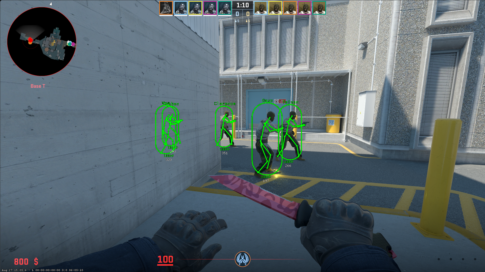
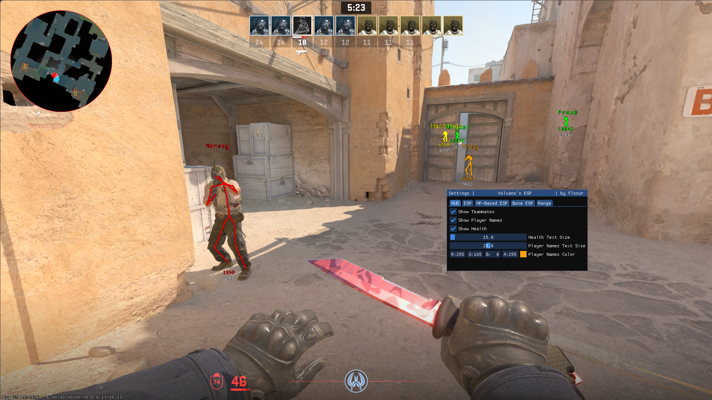
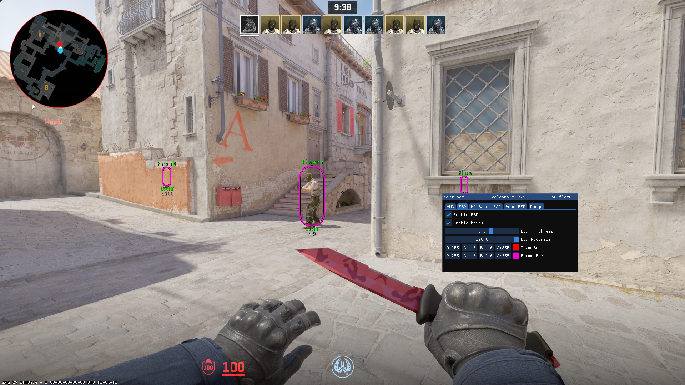

# Volcano ESP

 **Volcano** is a project composed of a **C++ client** and a **Go server** that implements an ESP for CS2, with authentication through an API and dynamic runtime offsets.

## Screenshots

  

  



## Features

- **ESP Overlay**  
  - Box ESP  
  - Bone ESP 
  - ImGui-based UI to configure visuals (box colors, distance display, health, player names, etc.)  

- **Handle Hijacking**  
  - Reads CS2 memory by hijacking Steam handles that have **read permissions**.  

- **Dynamic Offsets**  
  - Downloaded at runtime from the GitHub repository [a2x/cs2-dumper](https://github.com/a2x/cs2-dumper).  
  - Stored in memory with a dedicated logger.  

- **Go API Server**  
  - Built with `net/http`.  
  - Endpoints: `/auth/login`, `/auth/verify`, `/auth/logout`, `/health`.  
  - Stores and manages user data in a MySQL database.  
  - Privilege levels (`authorized`, `privileged`).  
  - Logger with `slog`. 
  - Intended to run on a deployed server (with optional reverse proxy like `Cloudflare`).  

- **Database (MySQL)**  
  - `users` table with:  
    `user_name`, `ip`, `api_key`, `authorized`, `privileged`, `last_seen`.  

## Prerequisites

- **Client (C++)**  
  - Visual Studio (solution `.sln` provided)  
  - Dependencies:  
    - [ImGui](https://github.com/ocornut/imgui)  
    - [spdlog](https://github.com/gabime/spdlog)  
    - [libcurl](https://curl.se/libcurl/)  
    - [nlohmann/json](https://github.com/nlohmann/json)  

- **Server (Go)**  
  - [Go](https://go.dev/) (1.21+)  
  - MySQL  

## Build & Run

### Client (ESP)

1. Open the Visual Studio solution.  
2. Build in **Release or Debug x64** mode.  
3. Run `volcano.exe`.  

### Server (API)

1. Configure your environment based on `.env.example`.  
2. Initialize the MySQL database using `database.sql`.  
   ```bash
   mysql -u <user> -p volcano < internal/database/init/database.sql
   ```
3. Run the server:  

   ```bash
   go run main.go
   ```
